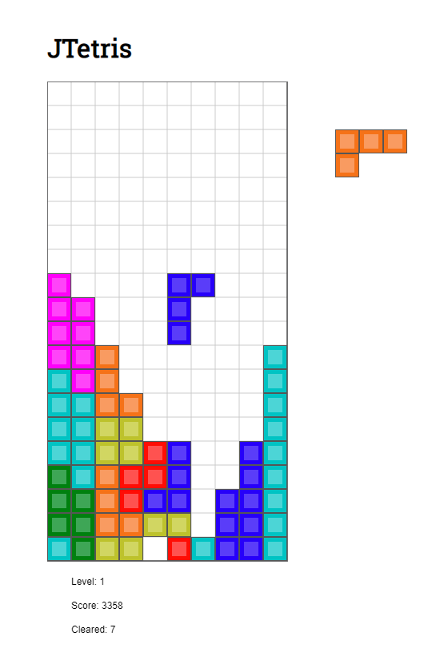

# jtetris

https://www.colinfahey.com/tetris/tetris.html

Just trying out a windows machine for a bit, getting dev setup. 
Thought it might be fun to learn some game programming.

It currently looks something like this: 

## Getting Started

```sh
$ npm i
$ npm start
```
